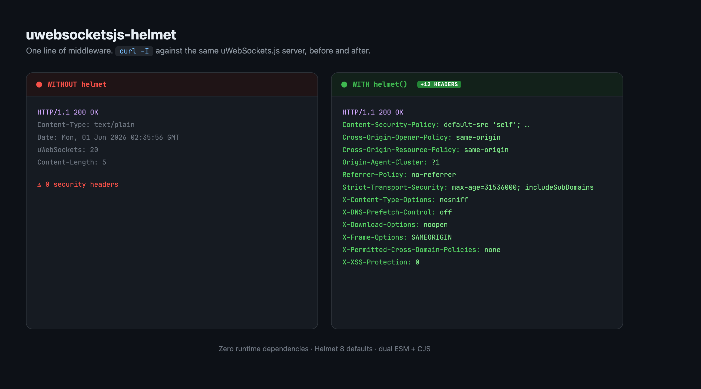

# uWebSockets.js Helmet

[](https://github.com/peterklingelhofer/uwebsocketsjs-helmet/actions/workflows/ci.yml)

A zero-dependency security headers middleware for [uWebSockets.js](https://github.com/uNetworking/uWebSockets.js), similar to [Helmet](https://github.com/helmetjs/helmet) for Express and [@fastify/helmet](https://github.com/fastify/fastify-helmet) for Fastify.

It writes a curated set of secure-by-default HTTP response headers (matching Helmet 8's defaults) onto a uWebSockets.js response, and lets you override, extend, or suppress any of them.



## Installation

This package is installed directly from GitHub. Install the latest from `main`:

```sh
npm i github:peterklingelhofer/uwebsocketsjs-helmet
# or
pnpm add github:peterklingelhofer/uwebsocketsjs-helmet
# or
yarn add github:peterklingelhofer/uwebsocketsjs-helmet
# or
bun add github:peterklingelhofer/uwebsocketsjs-helmet
```

To pin to a specific release, append a tag, branch, or commit:

```sh
npm i github:peterklingelhofer/uwebsocketsjs-helmet#v0.1.1
```

The `dist/` build is produced automatically on install (via the `prepare` script), so the GitHub syntax works for any tag or commit. Requires Node.js 22 or later, matching the runtimes uWebSockets.js ships prebuilt binaries for.

`uWebSockets.js` is an optional peer dependency (used only for TypeScript types). Install it the way that project documents, replacing the tag with your desired [release](https://github.com/uNetworking/uWebSockets.js/releases):

```sh
npm i uWebSockets.js@uNetworking/uWebSockets.js#v20.68.0
```

The package ships both ESM and CommonJS builds, so `import` and `require` both work.

## Basic usage

```ts
import { App } from "uWebSockets.js";
import { helmet } from "uwebsocketsjs-helmet";

const app = App();

app.any("/*", (res, req) => {
  helmet()(res, req); // apply the default security headers
  res.end("ok");
});

app.listen(9001, (token) => {
  console.log(token ? "Listening on port 9001" : "Failed to listen on port 9001");
});
```

## Automatic application

`secureApp` wraps every HTTP route on an app, the way `app.use(helmet())` works for Express. This is the recommended way to use the package: it applies the headers for you, and unlike calling `helmet()` by hand it cannot be applied in the wrong order.

```ts
import { App } from "uWebSockets.js";
import { secureApp } from "uwebsocketsjs-helmet";

const app = secureApp(App());

app.get("/", (res) => {
  res.end("ok");
});

app.get("/missing", (res) => {
  res.writeStatus("404 Not Found"); // preserved, wherever you write it
  res.end("nope");
});

app.listen(9001, () => {});
```

It takes the same overrides as `helmet()`:

```ts
const app = secureApp(App(), { "X-Frame-Options": "DENY" });
```

Rather than writing headers up front, it holds them until your handler commits the response, by writing a status, writing a header of its own, or writing a body. That means:

- a `res.writeStatus(...)` anywhere in your handler survives, so `404`s stay `404`s
- `app.ws(...)` is left alone, so WebSocket upgrades still complete with `101 Switching Protocols`
- your own headers are never duplicated, and `res.cork(...)`, chaining, and streamed `res.write` bodies all keep working

The app is wrapped in place and returned, so `secureApp(App())` reads naturally. Wrapping the same app twice throws rather than silently sending every header twice.

The cost is patching a handful of methods on each response; the native methods are put back as soon as the headers are written, so streaming stays on uWebSockets.js's own fast path. If you are counting nanoseconds, call `helmet()` by hand and follow the ordering rules below.

### Ordering rules

uWebSockets.js formats responses into a linear buffer rather than a hash table, so the order of your calls is the order of the bytes on the wire. Two rules follow, and both are easy to get wrong:

> **1. Write the status before the headers.** The first `res.writeHeader` commits the status line, calling `res.writeStatus("200 OK")` for you. A `res.writeStatus` *after* that point is silently discarded, so a handler that applies `helmet()` first and then sets `404` will answer `200 OK`.

```ts
app.get("/missing", (res) => {
  res.writeStatus("404 Not Found"); // status first
  helmet()(res);                    // then headers
  res.end("nope");
});
```

If you only ever answer `200 OK`, applying `helmet()` at the top of the handler is fine. Otherwise, either use [`secureApp`](#automatic-application), or pass the status to the handler so it is written in the right order for you:

```ts
app.get("/missing", (res) => {
  helmet()(res, "404 Not Found"); // status, then headers
  res.end("nope");
});
```

A string second argument is treated as the status; anything else, such as the `req` you get from the route, is ignored.

> **2. Never apply `helmet()` in a WebSocket `upgrade` handler.** (`secureApp` never does.) The same rule breaks the handshake: writing headers commits `200 OK`, so `res.upgrade()` can no longer send `101 Switching Protocols` and every client rejects the connection. Security headers are meaningless on a `101` response anyway, so leave `upgrade` handlers alone.

```ts
app.ws("/*", {
  upgrade: (res, req, context) => {
    // do NOT call helmet() here
    res.upgrade({}, req.getHeader("sec-websocket-key"), req.getHeader("sec-websocket-protocol"), req.getHeader("sec-websocket-extensions"), context);
  },
  open: () => {},
});
```

When responding outside the synchronous top of a route handler, wrap your `writeStatus`/`writeHeader`/`end` calls in `res.cork(...)`, and apply `helmet()` inside the corked callback.

## Custom headers

Pass overrides that are merged on top of the defaults. Set a value to `false` (or `""`) to suppress one of the defaults.

```ts
import { App } from "uWebSockets.js";
import { helmet, type HelmetHeaderOptions } from "uwebsocketsjs-helmet";

const customHeaders: HelmetHeaderOptions = {
  "Content-Security-Policy": "default-src 'self'; script-src 'self' 'unsafe-inline'",
  "X-Frame-Options": "DENY",          // override a default
  "Permissions-Policy": "geolocation=()", // add a header not in the defaults
  "Strict-Transport-Security": false, // suppress a default
};

const app = App();

app.any("/*", (res, req) => {
  helmet(customHeaders)(res, req);
  res.end("Hello from uWebSockets.js with custom security headers!");
});

app.listen(9001, () => {});
```

Header names are matched case-insensitively, as HTTP requires, so `x-frame-options` overrides the `X-Frame-Options` default instead of being sent alongside it as a second, conflicting header. The default's canonical casing is what goes on the wire.

### Validation

`helmet()` validates its configuration once, when you build the handler, and throws a `TypeError` on:

- a header name that is not a valid RFC 9110 token (contains a space, colon, newline, or is empty)
- a value containing control characters or non-ASCII bytes, which would otherwise let a `\r\n` inject arbitrary extra headers (HTTP response splitting), since uWebSockets.js writes what you give it to the socket verbatim
- two overrides that differ only by case, which is always a mistake

Because this happens at construction time, a malformed policy fails at startup rather than silently shipping on every response.

Build the handler once and reuse it for the hot path:

```ts
const secure = helmet(customHeaders);

app.any("/*", (res, req) => {
  secure(res, req);
  res.end("ok");
});
```

## Default headers

These mirror Helmet 8's defaults:

| Header | Value |
| --- | --- |
| `Content-Security-Policy` | `default-src 'self';base-uri 'self';font-src 'self' https: data:;form-action 'self';frame-ancestors 'self';img-src 'self' data:;object-src 'none';script-src 'self';script-src-attr 'none';style-src 'self' https: 'unsafe-inline';upgrade-insecure-requests` |
| `Cross-Origin-Opener-Policy` | `same-origin` |
| `Cross-Origin-Resource-Policy` | `same-origin` |
| `Origin-Agent-Cluster` | `?1` |
| `Referrer-Policy` | `no-referrer` |
| `Strict-Transport-Security` | `max-age=31536000; includeSubDomains` |
| `X-Content-Type-Options` | `nosniff` |
| `X-DNS-Prefetch-Control` | `off` |
| `X-Download-Options` | `noopen` |
| `X-Frame-Options` | `SAMEORIGIN` |
| `X-Permitted-Cross-Domain-Policies` | `none` |
| `X-XSS-Protection` | `0` |

The exported `defaultHeaders` object is available if you want to inspect or extend it programmatically.

## The API preset

Helmet's defaults are aimed at HTML documents a browser will render. If your uWebSockets.js server answers with JSON or serves WebSockets, most of that is inert: `Cross-Origin-Opener-Policy`, `Origin-Agent-Cluster`, `X-DNS-Prefetch-Control` and `X-Download-Options` are document-scoped, and a 330-byte HTML-shaped CSP is doing nothing for a payload that will never load a subresource.

`apiHeaders` is a leaner preset for that case. It is a complete replacement for the defaults, not an addition to them, so pass it as the overrides:

```ts
import { App } from "uWebSockets.js";
import { apiHeaders, secureApp } from "uwebsocketsjs-helmet";

const app = secureApp(App(), apiHeaders);
```

| Header | Value |
| --- | --- |
| `Content-Security-Policy` | `default-src 'none';frame-ancestors 'none'` |
| `Cross-Origin-Resource-Policy` | `same-origin` |
| `Referrer-Policy` | `no-referrer` |
| `Strict-Transport-Security` | `max-age=31536000; includeSubDomains` |
| `X-Content-Type-Options` | `nosniff` |
| `X-Frame-Options` | `DENY` |
| `X-Permitted-Cross-Domain-Policies` | `none` |

Seven headers at 302 bytes per response, against twelve at 663. The CSP is stricter than the default, not weaker: `default-src 'none'` denies everything rather than allowing same-origin subresources. `X-XSS-Protection` is dropped because that CSP already disables what the legacy auditor guarded.

Tune it like any other override set:

```ts
const app = secureApp(App(), { ...apiHeaders, "Cross-Origin-Resource-Policy": "cross-origin" });
```

Reach for `defaultHeaders` (the default) whenever you serve HTML.

## API

```ts
import {
  secureApp,                // (app, headers?) => app, wraps every HTTP route
  helmet,                   // (headers?) => (res, statusOrReq?) => void factory
  defaultHeaders,           // frozen Record<string, string> of the defaults above
  apiHeaders,               // frozen leaner preset for JSON and WebSocket services
  type HelmetHeaderOptions, // Record<string, string | false> for overrides
  type HelmetHandler,       // (res: HelmetResponse, statusOrReq?: unknown) => void
  type HelmetResponse,      // minimal { writeHeader(key, value) } shape a uWS response satisfies
} from "uwebsocketsjs-helmet";

// `helmet` is also the default export:
import helmet from "uwebsocketsjs-helmet";
```

- `apiHeaders` is a drop-in replacement for the defaults, aimed at non-HTML responses.
- `secureApp(app, headers?)` wraps every HTTP route on the app in place and returns it. `app.ws(...)` is untouched. Throws if applied twice.
- `helmet(headers?)` returns a handler that writes the merged headers; it resolves the active list once, so build it outside your route for the hot path. Pass a status string as the second argument to write it first.
- Both validate their headers at construction time and throw a `TypeError` on malformed input.
- A real uWebSockets.js `HttpResponse` satisfies `HelmetResponse` structurally, so no `uWebSockets.js` types are required at runtime.


## Limitations

Two things this package cannot do for you, both of them properties of uWebSockets.js rather than choices made here:

**Unmatched routes bypass it.** When no route matches, uWebSockets.js answers `404 File Not Found` itself, without running any handler, so nothing can add headers to that response. Register a catch-all and those requests go through your own handler instead:

```ts
const app = secureApp(App());
app.get("/health", handler);
app.any("/*", (res) => {
  res.writeStatus("404 Not Found");
  res.end("not found");
});
```

**The server banner cannot be removed.** uWebSockets.js appends `uWebSockets: 20` to every response from inside the library. Writing that header yourself adds a second one rather than replacing it, so the version stays visible. Strip it at a reverse proxy if that matters to you. This is the one Helmet behaviour with no equivalent here: Helmet's `X-Powered-By` removal has nothing to remove, but uWebSockets.js discloses its own version in its place.

## Development

```sh
npm install
npm run typecheck
npm test
npm run lint
npm run build
```

## License

MIT
